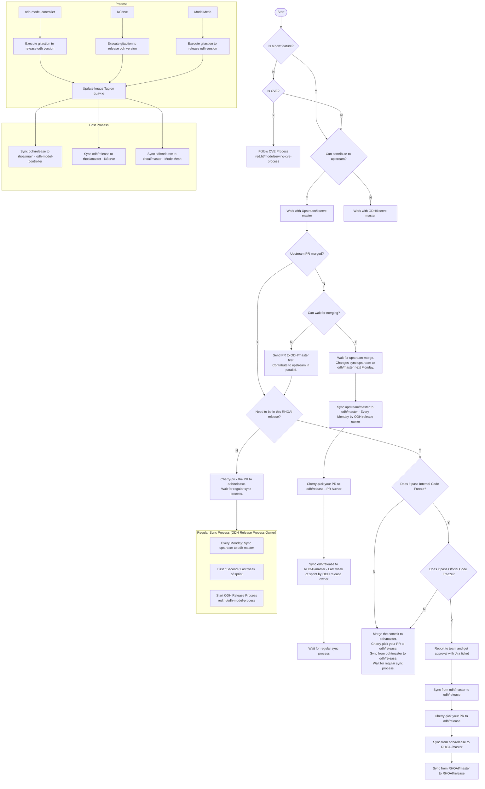
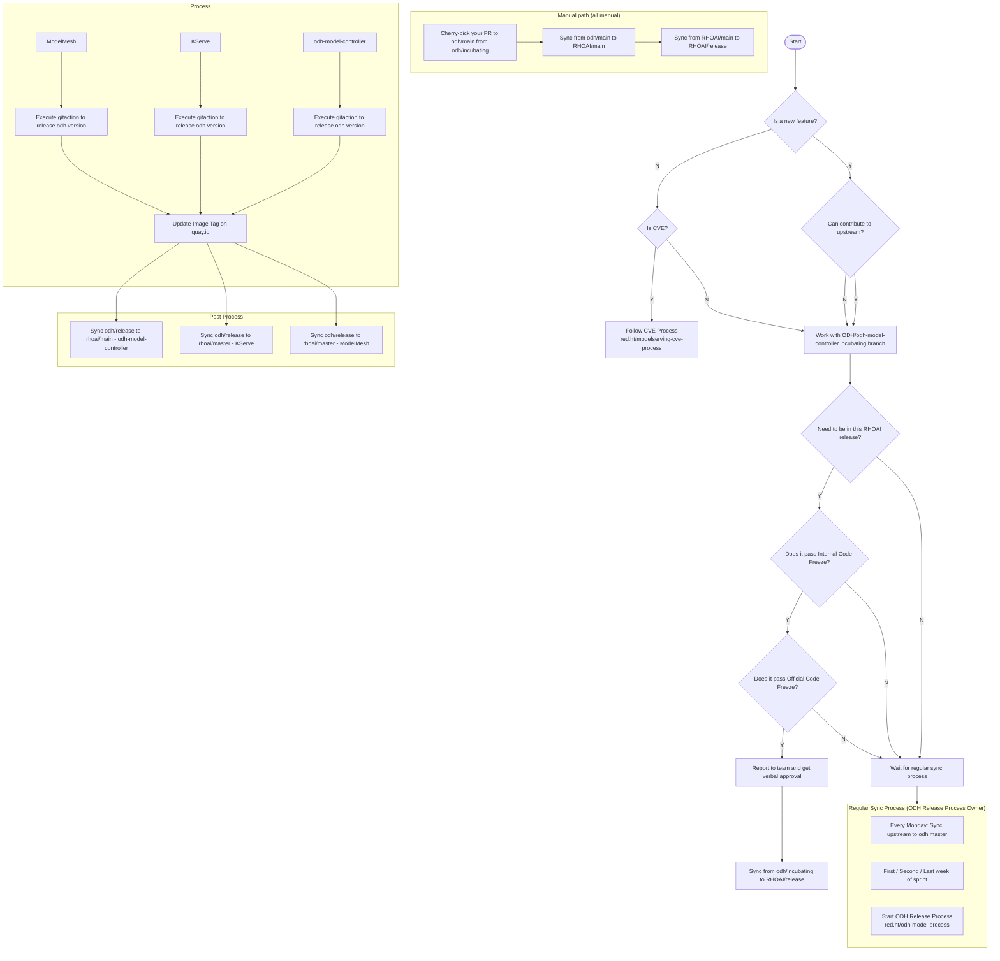

# Model Serving Development Workflow – Summary and Mermaid Diagrams

Summary and Mermaid versions of the drawio workflows for KServe/ModelMesh and odh-model-controller.

---

## Summary

The drawio file describes **two decision workflows** for getting changes into RHOAI (Red Hat OpenShift AI) model serving:

### 1. KServe / ModelMesh workflow

- **Entry:** “Is this a new feature?”
  - **Yes:** “Can you contribute to upstream (kserve/kserve)?”
    - **Yes:** Work on **Upstream/kserve master**; when upstream PR is merged, either wait for Monday sync to ODH or (if it must be in this RHOAI release) follow the RHOAI release path (code freezes, cherry-picks, syncs).
    - **No:** Work on **ODH/kserve master**; then “Need to be in this RHOAI release?” drives the same release path.
  - **No (not a new feature):** “Is it a CVE?”
    - **Yes:** Follow **CVE process** (red.ht/modelserving-cve-process).
    - **No:** Same “Can contribute to upstream?” branch as above.
- **RHOAI release path:** “Need to be in this RHOAI release?” → “Does it pass Internal Code Freeze?” → “Does it pass Official Code Freeze?”. If it fails a freeze: report to team, get approval (with Jira for KServe/ModelMesh), then either cherry-pick to odh/release and sync odh/master → odh/release, or wait for the **regular sync process**.
- **Regular sync (ODH Release Process Owner):** Every Monday sync upstream → odh master; first/second/last week of sprint: “Start ODH Release Process” (red.ht/odh-model-process). **Process:** release odh-model-controller, KServe, ModelMesh (GitHub actions), update image tags on quay.io, then **post process:** sync odh/release → rhoai/main (odh-model-controller) or rhoai/master (KServe, ModelMesh).

### 2. odh-model-controller workflow

- **Entry:** “Is this a new feature?”
  - **Yes:** “Can contribute to upstream?” → **Work with ODH/odh-model-controller incubating branch**.
  - **No:** “Is it a CVE?”
    - **Yes:** Follow **CVE process** (red.ht/modelserving-cve-process).
    - **No:** Same → **Work with ODH/odh-model-controller incubating branch**.
- **RHOAI release:** “Need to be in this RHOAI release?” → “Does it pass Internal Code Freeze?” → “Does it pass Official Code Freeze?”. If it fails: report to team and get **verbal** approval, then either “Wait for regular sync” or manual path: **Sync from odh/incubating to RHOAI/release** (Cherry-pick to odh/main from incubating → Sync odh/main → RHOAI/main → Sync RHOAI/main → RHOAI/release). All manual except where noted.
- **Regular sync and post process** match the KServe/ModelMesh diagram (ODH release process, release repos, update quay.io tags, sync odh/release to rhoai/main or rhoai/master).

---

## Mermaid: KServe / ModelMesh workflow

---

## Mermaid: odh-model-controller workflow

---

## References (from drawio)

- CVE process: red.ht/modelserving-cve-process  
- ODH release process: red.ht/odh-model-process  
