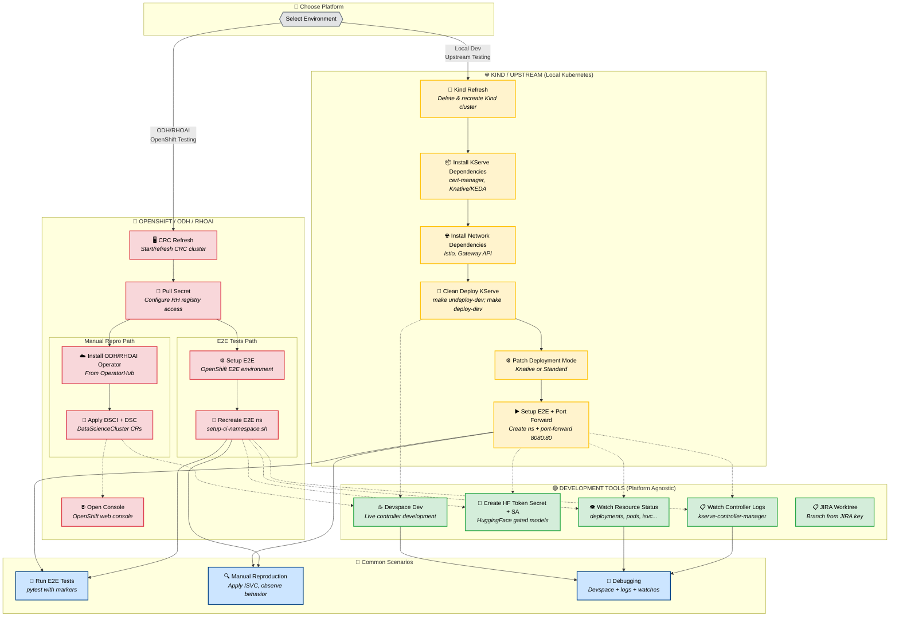

# KServe Development Workflow

This document describes the different development paths available via VS Code tasks.

## Workflow Diagram


```mermaid
flowchart TB
    subgraph start["🎯 Choose Platform"]
        A{{"Select Environment"}}
    end

    %% ============================================================
    %% KIND / UPSTREAM PATH (Yellow)
    %% ============================================================
    subgraph kind["☸️ KIND / UPSTREAM (Local Kubernetes)"]
        direction TB
        K1["🔄 Kind Refresh<br/><i>Delete & recreate Kind cluster</i>"]
        K2["📦 Install KServe Dependencies<br/><i>cert-manager, Knative/KEDA</i>"]
        K2b["🌐 Install Network Dependencies<br/><i>Istio, Gateway API</i>"]
        K3["🚀 Clean Deploy KServe<br/><i>make undeploy-dev; make deploy-dev</i>"]
        K4["⚙️ Patch Deployment Mode<br/><i>Knative or Standard</i>"]
        K5["▶️ Setup E2E + Port Forward<br/><i>Create ns + port-forward 8080:80</i>"]
        
        K1 --> K2
        K2 --> K2b
        K2b --> K3
        K3 --> K4
        K4 --> K5
    end

    %% ============================================================
    %% OPENSHIFT PATH (Red)
    %% ============================================================
    subgraph ocp["🔴 OPENSHIFT / ODH / RHOAI"]
        direction TB
        O1["🖥️ CRC Refresh<br/><i>Start/refresh CRC cluster</i>"]
        O2["🔑 Pull Secret<br/><i>Configure RH registry access</i>"]
        
        subgraph manual["Manual Repro Path"]
            O3["☁️ Install ODH/RHOAI Operator<br/><i>From OperatorHub</i>"]
            O4["🔧 Apply DSCI + DSC<br/><i>DataScienceCluster CRs</i>"]
        end
        
        subgraph e2e["E2E Tests Path"]
            O5["⚙️ Setup E2E<br/><i>OpenShift E2E environment</i>"]
            O6["🔄 Recreate E2E ns<br/><i>setup-ci-namespace.sh</i>"]
        end
        
        O7["🌐 Open Console<br/><i>OpenShift web console</i>"]
        
        O1 --> O2
        O2 --> O3
        O2 --> O5
        O3 --> O4
        O5 --> O6
        O4 -.-> O7
    end

    %% ============================================================
    %% DEVELOPMENT TOOLS (Green - Platform Agnostic)
    %% ============================================================
    subgraph dev["🟢 DEVELOPMENT TOOLS (Platform Agnostic)"]
        direction TB
        D1["☕ Devspace Dev<br/><i>Live controller development</i>"]
        D2["🔐 Create HF Token Secret + SA<br/><i>HuggingFace gated models</i>"]
        D3["👁️ Watch Resource Status<br/><i>deployments, pods, isvc...</i>"]
        D4["📋 Watch Controller Logs<br/><i>kserve-controller-manager</i>"]
        D5["📋 JIRA Worktree<br/><i>Branch from JIRA key</i>"]
    end

    %% ============================================================
    %% END GOALS
    %% ============================================================
    subgraph goals["🎯 Common Scenarios"]
        direction TB
        G1["🧪 Run E2E Tests<br/><i>pytest with markers</i>"]
        G2["🔍 Manual Reproduction<br/><i>Apply ISVC, observe behavior</i>"]
        G3["🐛 Debugging<br/><i>Devspace + logs + watches</i>"]
    end

    %% Connections
    A -->|"Local Dev<br/>Upstream Testing"| K1
    A -->|"ODH/RHOAI<br/>OpenShift Testing"| O1

    K5 --> G1
    K5 --> G2
    O6 --> G1
    O6 --> G2

    %% Development tools connect to both paths
    K3 -.-> D1
    K5 -.-> D3
    K5 -.-> D4
    K5 -.-> D2
    O4 -.-> D1
    O6 -.-> D3
    O6 -.-> D4
    O6 -.-> D2

    D1 --> G3
    D3 --> G3
    D4 --> G3

    %% Styling
    classDef kindStyle fill:#fff3cd,stroke:#ffc107,stroke-width:2px,color:#000
    classDef ocpStyle fill:#f8d7da,stroke:#dc3545,stroke-width:2px,color:#000
    classDef devStyle fill:#d4edda,stroke:#28a745,stroke-width:2px,color:#000
    classDef goalStyle fill:#cce5ff,stroke:#004085,stroke-width:2px,color:#000
    classDef startStyle fill:#e2e3e5,stroke:#6c757d,stroke-width:2px,color:#000

    class K1,K2,K2b,K3,K4,K5 kindStyle
    class O1,O2,O3,O4,O5,O6,O7 ocpStyle
    class D1,D2,D3,D4,D5 devStyle
    class G1,G2,G3 goalStyle
    class A startStyle
```

## Path Descriptions

### 🟡 KIND / Upstream Path (Local Kubernetes)

**Sequence:**
```
Kind Refresh -> Install Dependencies -> Install Network -> Deploy KServe -> Patch Mode -> Setup E2E + Port Forward
```

**Use when:**
- Testing upstream KServe changes
- Local development without OpenShift
- CI-like testing environment
- Quick iteration on controller code

**Tasks:**
| Task | Statusbar Label | Description |
|------|-----------------|-------------|
| Kind Refresh | `kind` | Delete and recreate Kind cluster |
| Install KServe Dependencies | `deps` | Install cert-manager, Knative or KEDA (based on deployment mode) |
| Install Network Dependencies | `network` | Install Istio, Gateway API (Istio or Envoy) |
| Clean Deploy KServe | `deploy` | `make undeploy-dev; make deploy-dev` with Gateway config |
| Patch Deployment Mode | `mode` | Set Knative or Standard mode (auto-detects if not specified) |
| Setup E2E + Port Forward (Kind) | `e2e+fwd` | Create ns + port-forward to Istio gateway |

**Deployment Mode Options:**

When running "Install KServe Dependencies", select the deployment mode:
| Option | Description |
|--------|-------------|
| Knative (serverless) | Install Knative Serving for serverless deployments |
| Standard (raw deployment) | Skip Knative, use raw Kubernetes deployments |

Optionally install KEDA for autoscaling with Standard mode.

**Network Layer Options:**

When running "Install Network Dependencies", select the network layer:
| Option | Description |
|--------|-------------|
| Istio Ingress (default) | Standard Istio ingress gateway |
| Istio + Gateway API | Istio with Kubernetes Gateway API |
| Envoy + Gateway API | Envoy Gateway with Kubernetes Gateway API |

When running "Clean Deploy KServe", select the matching gateway config:
| Option | Use When |
|--------|----------|
| None (Istio Ingress) | Selected "Istio Ingress" for network dependencies |
| Istio Gateway API | Selected "Istio + Gateway API" for network dependencies |
| Envoy Gateway API | Selected "Envoy + Gateway API" for network dependencies |

---

### 🔴 OpenShift / ODH / RHOAI Path

**Sequence:**
```
CRC Refresh -> Pull Secret -> [Choose Path]
                              |
                              +-> Manual Repro: Install Operator -> Apply DSCI+DSC
                              |
                              +-> E2E Tests: Setup E2E -> Recreate E2E ns
```

**Use when:**
- Testing ODH/RHOAI integration
- OpenShift-specific features (routes, ServiceMesh)
- Downstream validation before cherry-picks
- Reproducing customer issues on OpenShift

**Common Setup Tasks:**
| Task | Statusbar Label | Description |
|------|-----------------|-------------|
| CRC Refresh | `crc` | Start or refresh CRC OpenShift cluster |
| Pull Secret | `pull secret` | Configure Red Hat registry access |

**Manual Repro Path** (for manual testing/reproduction):
| Task | Statusbar Label | Description |
|------|-----------------|-------------|
| Install ODH/RHOAI Operator | `operator` | Install from OperatorHub (ODH or RHOAI) |
| Apply DSCI + DSC | `dsci+dsc` | Apply DataScienceCluster CRs |

**E2E Tests Path** (for running pytest E2E tests):
| Task | Statusbar Label | Description |
|------|-----------------|-------------|
| Setup E2E | `e2e setup` | Setup E2E test environment (installs operator, applies CRs) |
| Recreate E2E ns | `e2e ns` | Delete and recreate test namespace |

**Optional Tasks:**
| Task | Statusbar Label | Description |
|------|-----------------|-------------|
| Open OpenShift Console | `console` | Open web console in browser |

---

### 🟢 Development Tools (Platform Agnostic)

These tools work with both Kind and OpenShift clusters.

| Task | Statusbar Label | Description |
|------|-----------------|-------------|
| Devspace Dev | `devspace` | Live controller development with hot reload |
| Create HF Token Secret + SA | `hf secret` | Create HuggingFace token and service account for gated models |
| Watch Resource Status | `watch` | Monitor deployments, pods, ISVC status |
| Watch KServe Controller Logs | `logs` | Stream kserve-controller-manager logs |
| JIRA Worktree | `jira` | Create git worktree with branch from JIRA key |

---

## Common Scenarios

### 🧪 Running E2E Tests

**Kind:** Complete setup through "Setup E2E + Port Forward (Kind)", then `pytest test/e2e/ -m <marker>`.

**OpenShift:** CRC Refresh -> Pull Secret -> Setup E2E -> Recreate E2E ns, then `pytest test/e2e/ -m <marker>`.

Markers are defined in `test/e2e/pytest.ini`.

---

### 🔍 Manual Reproduction

**Kind:** After cluster + port forward, apply ISVC to `kserve-ci-e2e-test`, then `curl localhost:8080/v1/models/my-model:predict -d @input.json`. Use Watch Resource Status / Watch Controller Logs as needed.

**OpenShift:** After operator + DSCI+DSC, apply ISVC, then `oc get routes -n <namespace>` and test via route URL; use "Open OpenShift Console" for monitoring.

---

### 🐛 Debugging

**Live Development with Devspace:**
1. Deploy KServe normally, then run "Devspace Dev" (`devspace`). Edit code; changes sync. Use "Watch Controller Logs" (`logs`) to see output.
2. To attach a debugger, use the launch config in `launch.json`.

**Log Analysis:** "Watch KServe Controller Logs" and "Watch Resource Status"; check events: `kubectl get events -n <namespace> --sort-by='.lastTimestamp'`.

---

## Task Color Coding (Statusbar)

| Background Color | Meaning |
|-----------------|---------|
| 🟡 Yellow (warning) | Kind/Upstream tasks |
| 🔴 Red (error) | OpenShift tasks |
| 🟢 Green (default) | Platform-agnostic dev tools |

---

## Quick Start Cheatsheets

**Kind (E2E):** Kind Refresh → Install KServe Dependencies (choose Knative/Standard, KEDA) → Install Network Dependencies (Istio / Istio+GatewayAPI / Envoy+GatewayAPI) → Clean Deploy KServe (gateway: None / Istio / Envoy to match) → Patch Deployment Mode → Setup E2E + Port Forward (Kind) → `pytest test/e2e/ -m predictor`.

**Kind (Raw / Gateway API):** Same as above with Standard mode, Envoy + Gateway API, Envoy Gateway API for deploy; then `pytest test/e2e/ -m raw`.

**OpenShift (Manual):** CRC Refresh → Pull Secret → Install ODH/RHOAI Operator → Apply DSCI + DSC. Then apply ISVC and use routes.

**OpenShift (E2E):** CRC Refresh → Pull Secret → Setup E2E (select marker) → Recreate E2E ns → pytest.

**Controller iteration:** After cluster is up: change code → Clean Deploy KServe or Devspace Dev → Watch Controller Logs + Watch Resource Status.

